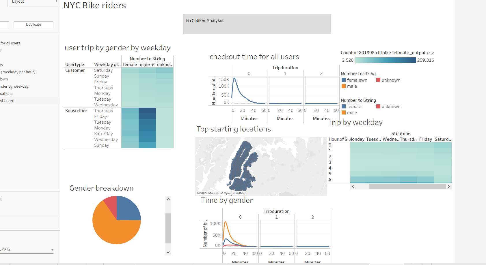

# NYC Citibike-Analysis-
Using Tableau to visualize our analysis

Overview of Project

-Purpose

Kate and I visited NYC on vacation and used bikes extensively to move arround and see places.

We now want to create a similar biking program in our home town.

Now that Kate and I got a good idea of how to create our story, there is still some more work to be done to convince investors
that a bike-sharing program in Des Moines is a solid business proposal. To solidify the proposal, one of the key stakeholders
 would like to see a bike trip analysis.

- Analysis and Challenges

Please see

Also please see th following

Summer months like August is the time when bike usage is the highest. Usage is most by men (males) 

-
- Overall conclusion

In my opinion more data nees to be analysed for taking such a big business decision. We need to do a similar analysis in other months to get a complete picute.

Two additionl visualizations:
Repairs and maintaenance of bikes
Accidents,locations and their timing during the day
 

