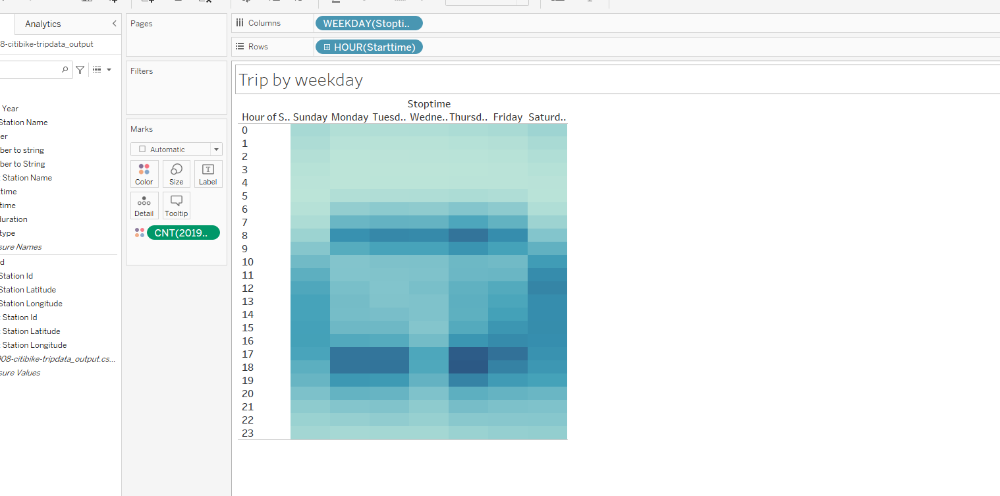

# NYC Citibike-Analysis-
Using Tableau to visualize our analysis

Overview of Project

-Purpose

Kate and I visited NYC on vacation and used bikes extensively to move arround and see places.

We now want to create a similar biking program in our home town.

Now that Kate and I got a good idea of how to create our story, there is still some more work to be done to convince investors
that a bike-sharing program in Des Moines is a solid business proposal. To solidify the proposal, one of the key stakeholders
 would like to see a bike trip analysis.

- Analysis and description of visualization

Please see below:
This image brings it all together to crate astory line of th bike usage by weekday, by gender, top starting points, checkout times

Also please see th following

1) Checkout time by user.
In this visualization the  graph the length of time that bikes are checked out for all riders.

2)Bike usage breakdown by gender
In this visualization the pie chart shows the usage of bikes by for each gender.

3) Usage time by gender
In this visualization the graph the length of time that bikes are checked out for each gender.

4) Top starting locations
In this map you can see that top pick stations in NYC,

5) Trip by gender by weekday
In this picture you can see the heatmap of daily usage for each gender for each hour during each day of the week 

6) Heatmap of usage
In this visualization, you'll see a heatmap that shows the number of bike trips broken down by gender for each day of the week by each Usertype.

7) Trip by weekday
In this visualization, you’ll see the number of bike trips by weekday for each hour of the day as a heatmap.

Summer months like August is the time when bike usage is the highest. Usage is most by men (males) 

-
- Overall conclusion

In my opinion more data nees to be analysed for taking such a big business decision. We need to do a similar analysis in other months to get a complete picute.

Two additionl visualizations:
Repairs and maintaenance of bikes
Accidents,locations and their timing during the day
 

